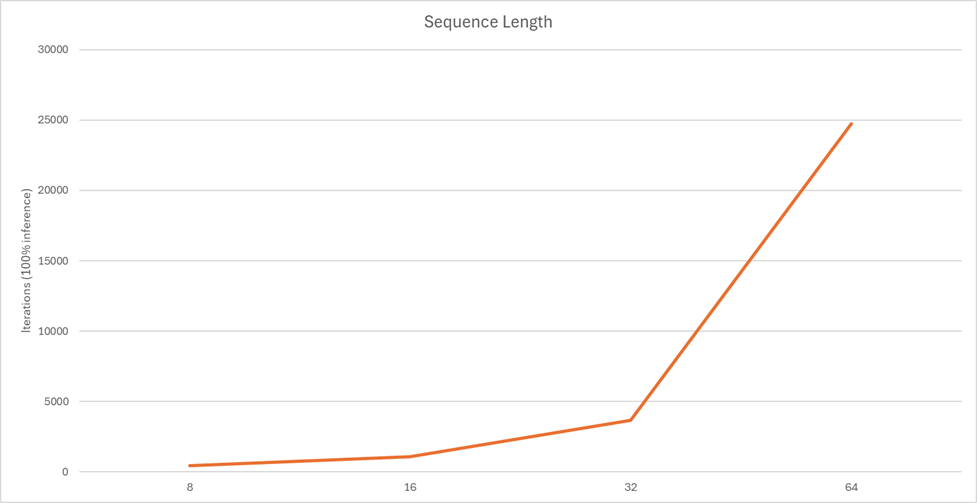
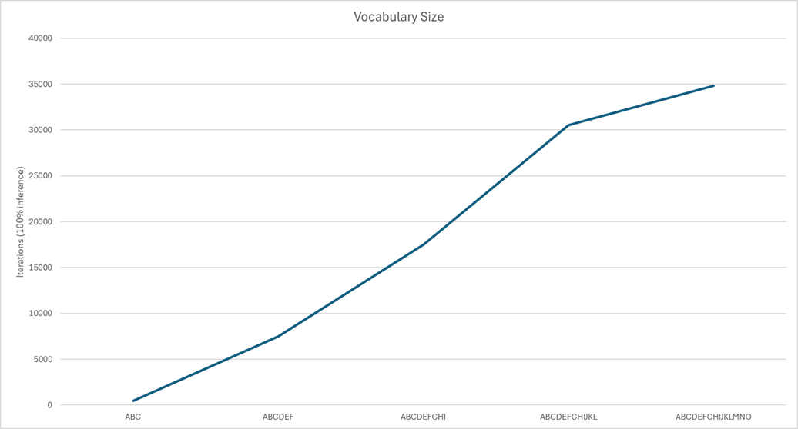

### Alphabetize a string of characters
An initial problem for training a model to do predictions (of what comes next) is to alphabetize a string of characters.

Rules:
 - Using an Alphabet of 3+ characters - 'A', 'B', and 'C'
 - Take sequences of 6+ characters and alphabetize
 - The characters are tokenized - A = 0, B = 1, C = 2, and padding = 3
 - Example of CBABBC and sort them alphabetically - ABBBCC

A model is considered 'trained' (with default settings) if it can correctly alphabetize 100 random sequences 10 times in a row.

This is an example command line to reproduce the experiment.
```
tinygpt.exe -d 1 -vo ABC
```

The model, regardless of configuration, settles into a solution (on average) in less than 1,000 iterations of 1,000 random trainings.  By varying the initialization strategies for weights and bias' we can shorten the time to train before getting consistent results.

Legend
 - Weights
  - 0 = Uniform random [-0.5, 0.5]
  - 1 = Uniform random [-1, 1]
  - 2 = Xavier
  - 3 = He
  - 4 = LeCun
 - Bias'
  - 0 = Uniform random [-0.5, 0.5]
  - 1 = Uniform random [-0.1, 0.1]
  - 2 = Constant (0)
  - 3 = Constant (0.1)
  = 4 = Constant (0.01)

Init strategies     | Min | Max | Avg | StdDev
--------------------|-----|-----|-----|-----------
4 (weight) 0 (bias) | 325 | 957 | 570 | 236.4639507
4 (weight) 1 (bias) | 396 | 711 | 551 | 127.807668
4 (weight) 2 (bias) | 295 | 730 | 462 | 150.7095219
4 (weight) 3 (bias) | 334 | 617 | 498 | 107.3778376
4 (weight) 4 (bias) | 394 | 800 | 529 | 150.6712979
--------------------|-----|-----|-----|-----------
3 (weight) 0 (bias) | 309 | 745 | 523 | 145.6689397
3 (weight) 1 (bias) | 351 | 1006 | 618 | 231.7096459
3 (weight) 2 (bias) | 313 | 997 | 652 | 218.7478914
3 (weight) 3 (bias) | 419 | 5000 | 1610 | 1725.559921
3 (weight) 4 (bias) | 347 | 1371 | 686 | 368.7868761
--------------------|-----|-----|-----|-----------
2 (weight) 0 (bias) | 375 | 668 | 488 | 107.0674554
2 (weight) 1 (bias) | 340 | 594 | 480 | 93.72854421
2 (weight) 2 (bias) | 371 | 942 | 600 | 239.6784513
2 (weight) 3 (bias) | 455 | 3174 | 1216 | 998.3553676
2 (weight) 4 (bias) | 422 | 1019 | 652 | 240.0933152
--------------------|-----|-----|-----|-----------
0 (weight) 0 (bias) | 388 | 740 | 533 | 130.6568023
0 (weight) 1 (bias) | 370 | 685 | 506 | 111.3649855
0 (weight) 2 (bias) | 380 | 967 | 551 | 216.7278478
0 (weight) 3 (bias) | 492 | 1384 | 704 | 342.6469904
0 (weight) 4 (bias) | 353 | 628 | 489 | 111.6576912
--------------------|-----|-----|-----|-----------
1 (weight) 0 (bias) | 668 | 1306 | 889 | 222.964033
1 (weight) 1 (bias) | 425 | 1036 | 668 | 224.2930226
1 (weight) 2 (bias) | 663 | 865 | 779 | 72.53302696
1 (weight) 3 (bias) | 632 | 1210 | 880 | 203.767122
1 (weight) 4 (bias) | 692 | 1533 | 1062 | 312.1326641

Based on these trainings, the LeCun weight initialization strategy yielded the quickest train model (regardless of bias initialization) and Uniform random -1 to 1 yielded the slowest.  The only training run that did not yielded a trained model in the timeframe was He (weight) with 0.1 (bias).

### Increase the sequence length and vocabulary size
Increases in the vocabulary have a direct impact on convergence time.  As the vocabular size and sequence size increases the time to train increases.  The reason is that there are two variables being adjusted at the same time.  

The first is the neural network which is depended on both of these variables.  The inputs, output, and hidden layers are proportional to these sizes.  The size of the network increases computation time for both forward and backward propagation.

The second is that as these variable increase the total number of possible sequences increases.  Since the training is looking for 100% accuracy (which is not realistic/necessary in most cases) the training takes longer to reach that point.


#### Increase in Sequence Length
The time it takes for a model to become trained is growing faster than linear.  This is caused by the model having its hidden layers being proportional to sequence length.



```
tinygpt.exe -d 1 -tr 50000 -it 1000 -in 100 -vo ABC -se 8 -w 4 -b 2
tinygpt.exe -d 1 -tr 50000 -it 1000 -in 100 -vo ABC -se 16 -w 4 -b 2
tinygpt.exe -d 1 -tr 50000 -it 1000 -in 100 -vo ABC -se 32 -w 4 -b 2
tinygpt.exe -d 1 -tr 50000 -it 1000 -in 100 -vo ABC -se 64 -w 4 -b 2
```

Increasing the vocabulary size results in a linear increase in time to train a model.



```
tinygpt.exe -d 1 -tr 50000 -it 1000 -in 100 -vo ABC -se 8 -w 4 -b 2
tinygpt.exe -d 1 -tr 50000 -it 1000 -in 100 -vo ABCDEF -se 8 -w 4 -b 2
tinygpt.exe -d 1 -tr 50000 -it 1000 -in 100 -vo ABCDEFGHI -se 8 -w 4 -b 2
tinygpt.exe -d 1 -tr 50000 -it 1000 -in 100 -vo ABCDEFGHIJKL -se 8 -w 4 -b 2
tinygpt.exe -d 1 -tr 50000 -it 1000 -in 100 -vo ABCDEFGHIJKLMNO -se 8 -w 4 -b 2
```

